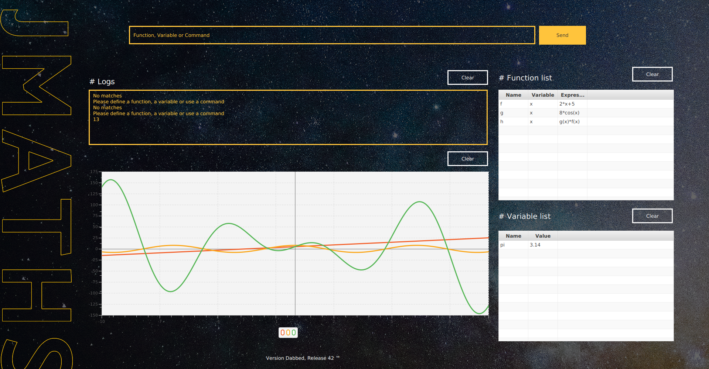
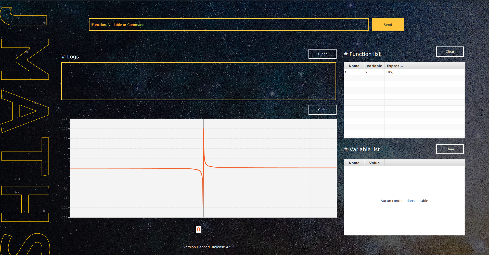
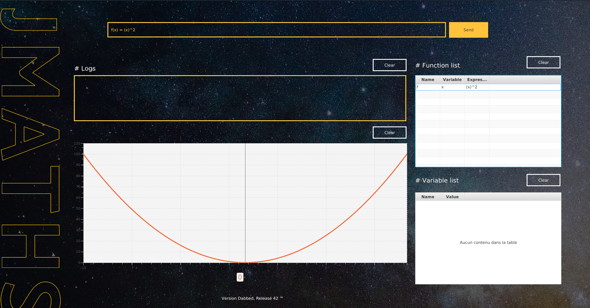
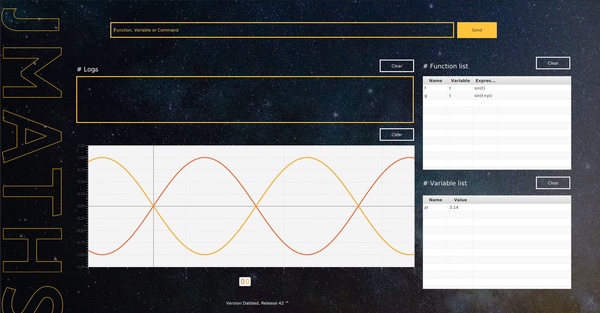

##### Jung Victor - Pecqueux William

---

# JMaths

Here a little school project about a curve plotter using JavaFx, you can define, combine and plot your functions., also you can declare custom variables.

You can plot every kind of linear and trigonometric functions.

Use the up and down arrows to get your previous inputs.

**Note :** Unlike a lot of people we have chooses to don't use MxParser, we just imported a raw expression solver.




## Documentation

### Function declaration

```
functionName(variable)=expression
```

- functionName : Only letters
- variable : Only letters
- Stored in the function list

### Expression

- Operators : +, -, *, /, ^
- You have to use parenthesis for the power, divide and times operator, example : (2*x)^2 or 1/(x)
- Trigonometric function : cos(), sin, tan, arccos, arcsin, arctan, e, log, ln
- Parenthesis priority.

### Variable declaration

```
variableName=expression
```

- variableName : Only letters
- Stored in the variable list

### Print function

Evaluate the function with the wanted value.

```
print(functionName,value)
```

- functionName : Name of an existing function.
- value : Number or variable.

### Plot function

Plot the function's curve between, you choose the bounds and the number of points calculated.

```
plot(functionName,lowerBound,upperBound,numberOfPoints)
```

- functionName : Name of an existing function.

- lowerBound, upperBound, numberOfPoints : Number.

  

## How it works

The input is analyzed by Regex to detect if the text match to a valid command, important infos are extracted from the input. Then for plotting it's calculating the function's expression for the number of point wanted.

To evaluate an expression we are using 3 layers of solvers:

- The function solver : detect and replace function name by their expression. If the function name is a known trigonometric function and the argument is numerical then it evaluate and replace it.
- The variable solver : detect and replace variable name by their value, it's recursive so you can add variables into variable.
- The raw solver : All credit goes to Mark Alexander Edwards Jr. It allows us to get the numerical value or a raw expression.

## Examples

Inverse function :




Square function : 




Two sinus functions, the yellow one has a phase difference of pi :




 

